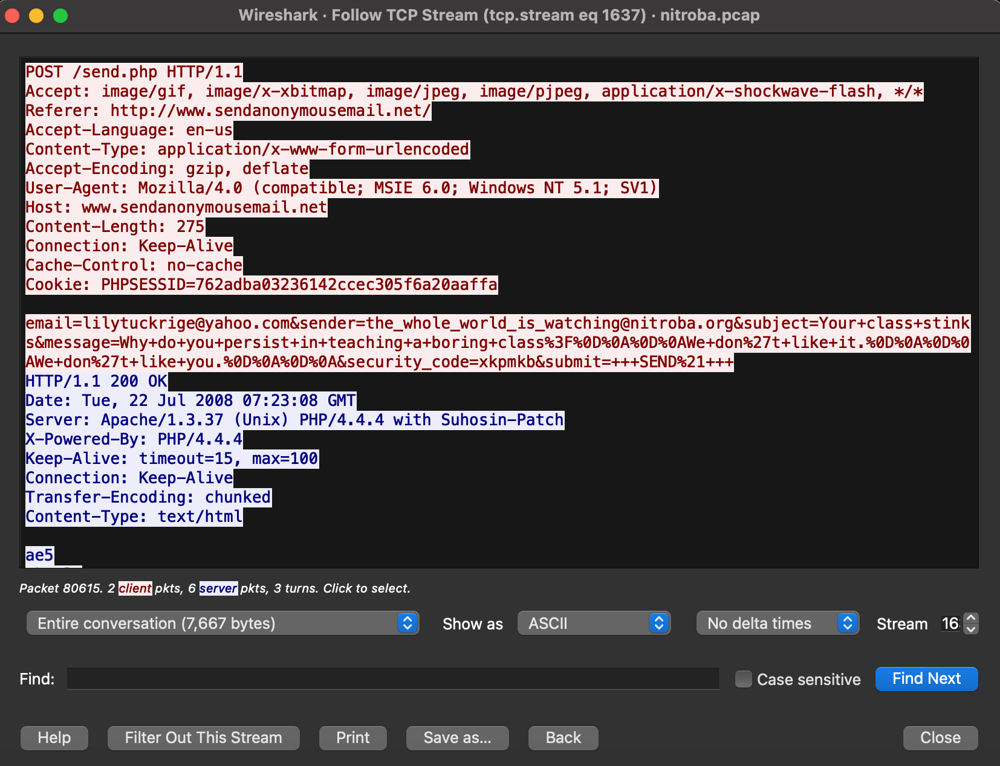
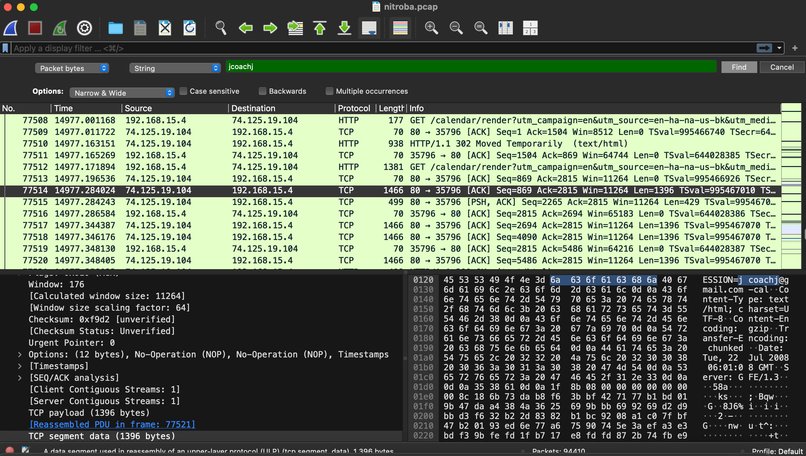
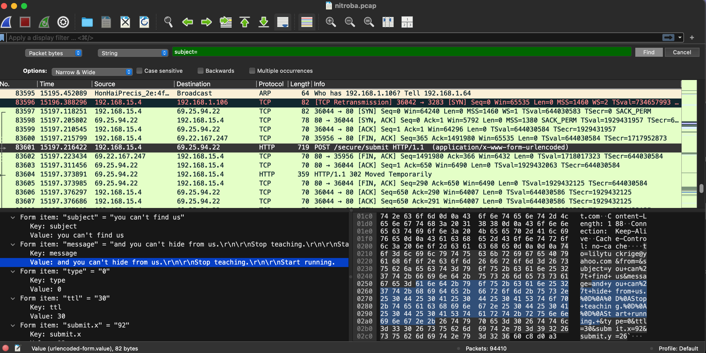
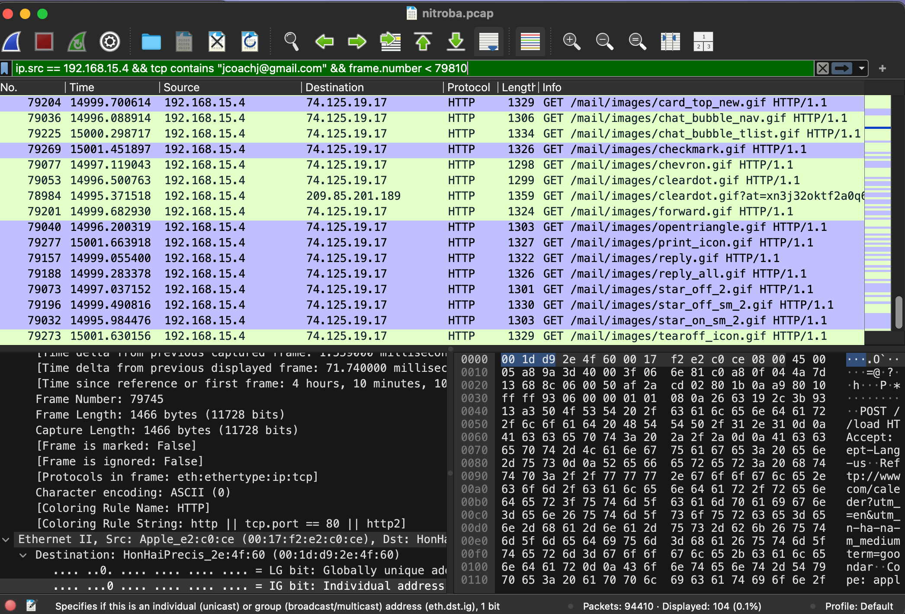
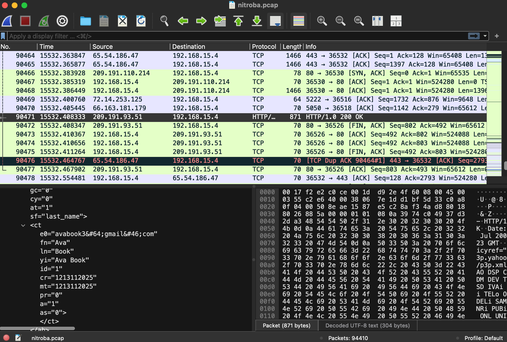
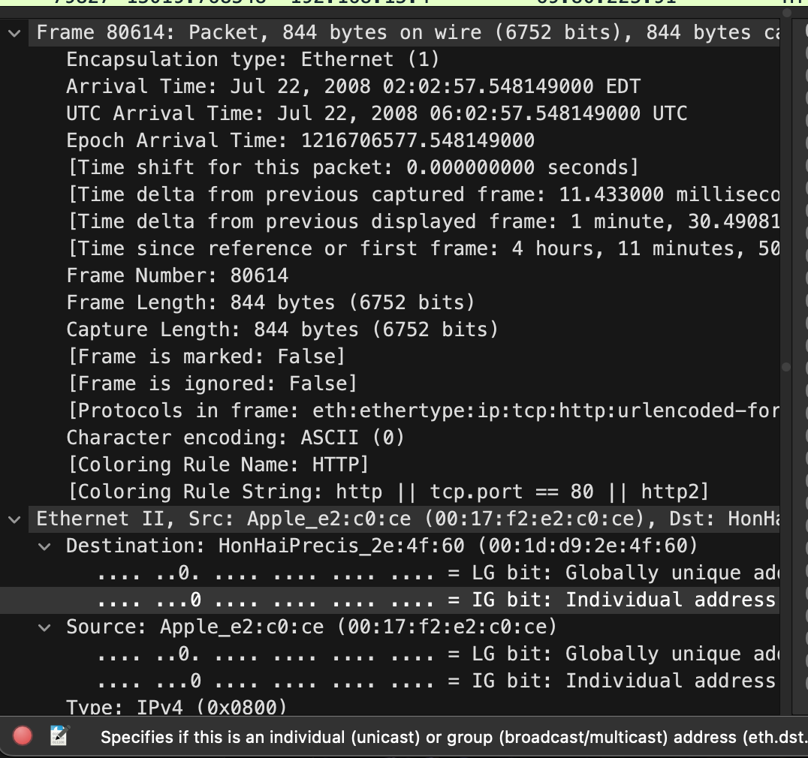
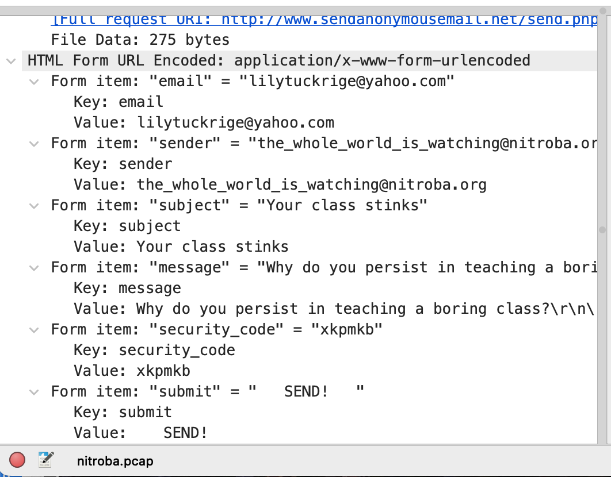
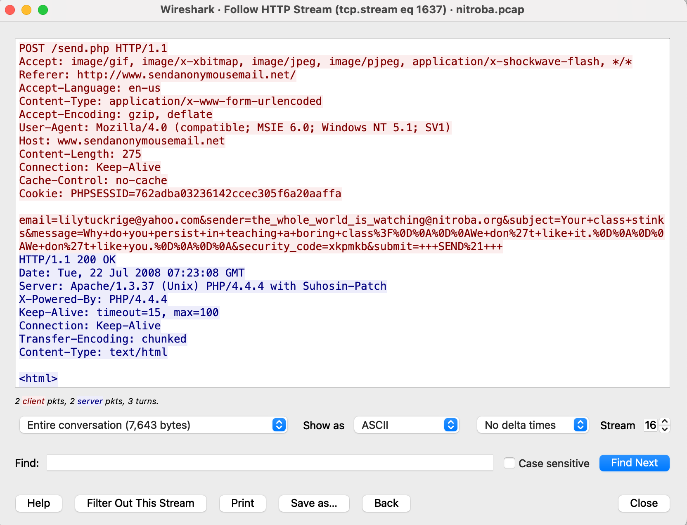

# Evidence Exhibits

This directory documents the screenshots collected during the Wireshark investigation.

### Exhibit 01 — Anonymous Email HTTP Stream

**Finding:** The followed TCP stream shows an HTTP `POST /send.php` request to `www.sendanonymousemail.net`. The submitted form data includes the destination email, sender address, subject, message content, and security code. The server responded with `HTTP/1.1 200 OK`.

### Exhibit 02 — Gmail Account Artifact Search

**Finding:** A packet-byte search for `jcoachj` identifies the account string within Gmail-related network traffic. This provides an account artifact that can be correlated with other activity in the packet capture.

### Exhibit 03 — Threatening Message Content

**Finding:** The decoded HTTP form data shows the subject `you can't find us` and message content including `and you can't hide from us`, `Stop teaching`, and `Start running`. This captures the threatening message directly within the network traffic.

### Exhibit 04 — Gmail Packet Filter

**Finding:** Wireshark filtering isolates traffic from `192.168.15.4` containing the `jcoachj@gmail.com` string. This narrows the packet capture to traffic relevant to the Gmail artifact under investigation.

### Exhibit 05 — Gmail Artifact Correlation

**Finding:** Additional packet evidence provides context for correlating the `jcoachj` Gmail artifact with network activity observed from the workstation. The account string is treated as a technical artifact rather than proof of the identity of the person operating the host.

### Exhibit 06 — Anonymous Email Timestamp

**Finding:** Wireshark frame details for packet `80614` document an arrival time of July 22, 2008 at `02:02:57.548149 EDT` (`06:02:57.548149 UTC`). This provides a timestamp for the anonymous-email activity examined in the capture.

### Exhibit 07 — Identity-Related Web Artifact

**Finding:** Captured web content provides an additional identity-related artifact encountered during the investigation. This evidence is retained for correlation with the other network artifacts and is not, by itself, treated as proof of user identity.

### Exhibit 08 — Anonymous Email Form Fields

**Finding:** The decoded form submission exposes fields associated with the anonymous-email transaction, including the destination email, sender, subject, message, security code, and submission value. This provides a readable view of the data transmitted in the HTTP request.

## Evidence handling note

These exhibits come from a training packet capture and are presented for educational network-forensics analysis. Findings should distinguish direct packet evidence from attribution. An email/account string appearing in traffic does not by itself prove the identity of the person operating the host.
